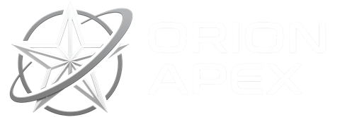

# Interstellar Agency

**Orion Apex · CM1605 Web Technology Coursework**

A premium fictional **space-tourism** website. Browse 90 cosmic destinations, 15 curated packages, and a fleet of 15 spaceships — then submit a booking inquiry. Built with **vanilla HTML, CSS, and JavaScript**, driven by a single **XML** catalogue.

<br>

<p align="center">
  
</p>

<p align="center">
  <strong>Open <code>index.html</code> in any modern browser</strong><br>
  No build step · No server · No internet required
</p>

---

## Features

| Area | What you get |
|------|----------------|
| **Catalogue** | 90 destinations · 15 packages · 15 spaceships |
| **Explore** | Category filters + live search on Destinations |
| **Details** | Templated package & spaceship pages via `?id=` |
| **Booking** | 6 form control types · custom JS validation · success UI |
| **Theme** | Dark / light toggle (remembered in `localStorage`) |
| **UX** | Shared nav/footer · “Ask Orion” chatbot · star ratings · USD prices |
| **Design** | Strict monochrome UI · full-colour photos & hero video only |
| **SEO / AEO** | Meta + Open Graph · JSON-LD (`TravelAgency`, `FAQPage`) |

---

## Quick start

1. Clone or download this repository.
2. Open **`index.html`** (double-click or drag into Chrome / Edge / Firefox).
3. Browse Destinations → Packages → Spaceships → **Book Journey**.

> **Note:** The site is designed for the `file://` protocol. Catalogue XML is embedded in `data/destinations.js` so local `fetch()` is not required.

---

## Tech stack

- **HTML5** — semantic structure across 9 pages  
- **CSS3** — one global stylesheet, design tokens, responsive grids  
- **JavaScript (ES6)** — DOM components, XML parse, filters, validation  
- **XML** — single source of truth for catalogue data  
- **No** React / Vue / Node / Bootstrap / Tailwind  

---

## Project structure

```text
ORION_APEX_CM1605_Sem2_CW/
├── index.html              # Home — hero video, stats, featured mix
├── destinations.html       # Explorer — filter + search
├── packages.html           # All packages
├── package.html            # Package detail (?id=PKG-XX)
├── spaceships.html         # Fleet listing
├── spaceship.html          # Ship detail (?id=SHIP-XX)
├── booking.html            # Booking inquiry form
├── about.html              # Mission, fleet, FAQ
├── terms.html              # Terms & conditions
├── css/
│   └── global.css          # Theme tokens, layout, components
├── js/
│   ├── app.js              # Nav, footer, XML → cards, filters, chat
│   └── validation.js       # Booking form validation (no HTML5 required)
├── data/
│   ├── destinations.xml    # Master catalogue (rubric source of truth)
│   └── destinations.js     # Same XML as DESTINATIONS_XML for file://
├── assets/                 # Logo, fonts, images, hero video
├── Planning_and_Docs/      # Wireframes + viva practice questions
├── project-blueprint.md    # Full project blueprint
└── README.md               # You are here
```

---

## How the data works

```text
destinations.xml  ──►  destinations.js (string)  ──►  DOMParser in app.js
                                                              │
                    destinations / packages / spaceships JS objects
                                                              │
                         cards · filters · detail pages · homepage mix
```

| Piece | Role |
|-------|------|
| `data/destinations.xml` | Canonical XML database |
| `data/destinations.js` | Embedded copy so the site runs offline from disk |
| `js/app.js` → `getData()` | Parses XML, builds objects, renders UI |
| Empty grids in HTML | e.g. `#destinations-grid` — filled by JavaScript |

---

## Pages at a glance

| Page | Role |
|------|------|
| Home | Hero video, stats (90 / 15 / 6), featured destinations & packages |
| Destinations | Category pills + search over all 90 records |
| Packages / Package detail | Grid → itinerary, stops, FAQ |
| Spaceships / Ship detail | Fleet → full specifications table |
| Booking | Name, email, spacecraft, class, add-ons, notes |
| About | Mission, catalogue overview, safety, FAQ |
| Terms | Legal & transit policies |

---

## Design

- **Monochrome chrome** — UI is black/white only; imagery carries colour  
- **Typography** — Archivo (headings) · Inter (body), both self-hosted  
- **Tokens** — `--bg`, `--text`, `--border` flip for light mode via `html.light`  
- **Responsive** — CSS Grid / Flexbox, hamburger nav under ~860px  
- **Motion** — subtle hovers; respects `prefers-reduced-motion`  

More detail: see [project-blueprint.md](./project-blueprint.md).

---

## Coursework constraints (satisfied)

- Vanilla stack only — no frameworks or CSS libraries  
- Catalogue data from local XML, parsed in JavaScript  
- Booking uses custom validation — **no** HTML5 `required` / `pattern`  
- Booking includes **six** control types: text, email, select, radio, checkbox, textarea  
- Shared components and separation of concerns (HTML / CSS / JS / XML)  

---

## Scripts loaded on pages

```html
<script src="data/destinations.js"></script>
<script src="js/app.js"></script>
<!-- booking.html also loads: -->
<script src="js/validation.js"></script>
```

Event handlers use **`addEventListener`** in JavaScript (not inline `onclick` in HTML).

---

## Licence & academic use

Coursework project for **CM1605 Web Technology**.  
Fictional brand and content — for educational demonstration only.

---

<p align="center">
  <sub>© 2145 Interstellar Agency · All systems operational</sub>
</p>
